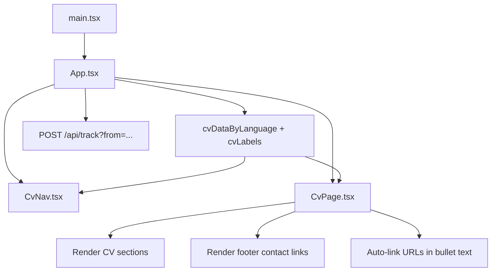

# Ngô Hồng Quân - Online CV


Online CV/portfolio cá nhân của **Ngô Hồng Quân**, được xây dựng bằng **React + TypeScript + Vite**. Dự án tập trung vào trải nghiệm đọc CV nhanh, rõ ràng, có thể chuyển đổi **Tiếng Việt/English**, có thanh điều hướng sticky, link liên hệ, footer, và tự nhận diện URL trong nội dung CV để người xem có thể click trực tiếp.

README này được viết để cả **người dùng** và **AI/coding agent** đọc vào có thể hiểu nhanh dự án, biết nên sửa file nào, chạy lệnh nào, và tránh làm sai kiến trúc hiện có.

## Mục Tiêu Dự Án

- Hiển thị CV cá nhân theo giao diện web gọn, dễ đọc, phù hợp để gửi nhà tuyển dụng.
- Hỗ trợ hai ngôn ngữ: Tiếng Việt và English.
- Cho phép người xem truy cập nhanh các kênh liên hệ: Email, Zalo, GitHub, Facebook, YouTube.
- Tự động biến các URL trong mô tả kinh nghiệm/dự án thành link có thể click.
- Có thể deploy dễ dàng lên Vercel hoặc static hosting khác.
- Codebase đủ đơn giản để chỉnh nội dung CV mà không cần thay đổi logic giao diện.

## Tính Năng Chính

| Tính năng | Mô tả |
| --- | --- |
| CV song ngữ | Nút đổi `English` / `Tiếng Việt` nằm ở góc phải thanh công cụ. |
| Sticky navigation | Thanh điều hướng cố định trên đầu, tự highlight section đang xem. |
| Nội dung tách khỏi UI | Toàn bộ dữ liệu CV nằm trong `src/cv/cvData.ts`. |
| Link tự động | URL trong bullet như GitHub, website dự án được render thành link. |
| Footer liên hệ | Cuối CV có khu vực thông tin liên hệ đầy đủ. |
| Responsive | Giao diện tối ưu cho desktop và mobile. |
| Tracking endpoint | Có `api/track.js` để tracking lượt truy cập khi deploy trên Vercel. |

## Thông Tin CV

| Mục | Nội dung |
| --- | --- |
| Họ tên | Ngô Hồng Quân |
| Vai trò | Backend Developer |
| Địa điểm | Hanoi, Vietnam |
| Email | [quanyyyb@gmail.com](mailto:quanyyyb@gmail.com) |
| GitHub | [github.com/quanton2003](https://github.com/quanton2003) |
| Facebook | [facebook.com/nhin.cai.ccll](https://www.facebook.com/nhin.cai.ccll) |
| YouTube | [@ngohongquan4962](https://www.youtube.com/@ngohongquan4962) |
| Zalo | 0343174165 |

## Tech Stack

| Nhóm | Công nghệ |
| --- | --- |
| Framework | React 19 |
| Language | TypeScript 5.9 |
| Build tool | Vite 8 |
| Styling | CSS thuần trong `src/cv.css` |
| Serverless API | Vercel Function trong `api/track.js` |
| Package manager | npm |

## Cấu Trúc Dự Án

```text
.
+-- api/
|   +-- track.js              # Serverless API tracking lượt truy cập
+-- public/
|   +-- favicon.png           # Avatar/logo hiển thị trên nav và favicon
|   +-- icons.svg             # Asset icon public
+-- src/
|   +-- cv/
|   |   +-- CvNav.tsx         # Thanh điều hướng + nút đổi ngôn ngữ
|   |   +-- CvPage.tsx        # Layout CV, header, sections, footer, auto-link URL
|   |   +-- cvData.ts         # Dữ liệu CV song ngữ + label UI
|   +-- App.tsx               # State ngôn ngữ + tracking call + composition chính
|   +-- cv.css                # Toàn bộ styling chính của CV
|   +-- main.tsx              # React entry point
|   +-- vite-env.d.ts
+-- index.html
+-- package.json
+-- package-lock.json
+-- tsconfig.json
+-- vite.config.ts
+-- README.md
```

Một số file như `src/main.ts`, `src/style.css`, `src/counter.ts`, `src/assets/*` có thể là phần scaffold ban đầu của Vite. Luồng CV hiện tại dùng `src/main.tsx`, `src/App.tsx`, `src/cv/*`, và `src/cv.css`.

## Luồng Hoạt Động



## Cách Chạy Local

Yêu cầu:

- Node.js 20 hoặc mới hơn
- npm

Cài dependencies:

```bash
npm install
```

Chạy development server:

```bash
npm run dev
```

Vite thường chạy tại:

```text
http://localhost:5173/
```

Trên Windows PowerShell, nếu `npm` bị chặn bởi Execution Policy, dùng:

```bash
npm.cmd run dev
```

## Build Production

Kiểm tra TypeScript và build production:

```bash
npm run build
```

Hoặc trên Windows PowerShell nếu cần:

```bash
npm.cmd run build
```

Xem thử bản build:

```bash
npm run preview
```

Output production nằm trong:

```text
dist/
```

## Cách Chỉnh Nội Dung CV

Toàn bộ dữ liệu CV nằm ở:

```text
src/cv/cvData.ts
```

Các export quan trọng:

| Export | Vai trò |
| --- | --- |
| `CvData` | Type định nghĩa cấu trúc dữ liệu CV. |
| `CvLanguage` | Union type hiện tại: `'vi' | 'en'`. |
| `CvLabels` | Type cho label UI theo ngôn ngữ. |
| `cvLabels` | Label nav, section, footer, aria text theo từng ngôn ngữ. |
| `cvDataByLanguage` | Dữ liệu CV Tiếng Việt và English. |
| `cvData` | Dữ liệu mặc định, hiện trỏ về bản Tiếng Việt. |

Các phần thường cần sửa:

| Phần | Vị trí |
| --- | --- |
| Tên, chức danh, email, GitHub, Facebook, YouTube, Zalo | `sharedHeader` |
| Tóm tắt bản thân | `cvDataByLanguage.vi.summary` và `cvDataByLanguage.en.summary` |
| Kỹ năng | `skills` |
| Kinh nghiệm | `experience` |
| Dự án | `projects` |
| Học vấn | `education` |
| Kỹ năng mềm | `softSkills` |
| Label giao diện | `cvLabels` |

Ví dụ thêm một dự án:

```ts
projects: [
  {
    title: 'Project Name - Personal Project',
    date: '01/2026 - 03/2026',
    bullets: [
      'Built the backend API with Node.js and Express.js.',
      'Implemented JWT authentication and role-based authorization.',
      'GitHub: https://github.com/username/project',
    ],
  },
]
```

Các URL bắt đầu bằng `http://` hoặc `https://` trong bullet sẽ tự động được render thành link click được.

## Cách Chỉnh Giao Diện

Styling chính nằm ở:

```text
src/cv.css
```

Các class quan trọng:

| Class | Vai trò |
| --- | --- |
| `.cv-nav` | Thanh điều hướng sticky trên cùng. |
| `.cv-nav-actions` | Nhóm link nav và nút đổi ngôn ngữ. |
| `.cv-language-toggle` | Nút chuyển Tiếng Việt/English. |
| `.cv-page` | Khung CV chính. |
| `.cv-header` | Header gồm tên, chức danh, liên hệ, icon social. |
| `.cv-section-title` | Tiêu đề từng section. |
| `.cv-skills` | Danh sách nhóm kỹ năng. |
| `.cv-timeline` | Layout timeline cho kinh nghiệm và dự án. |
| `.cv-bullets` | Danh sách bullet trong CV. |
| `.cv-footer` | Footer thông tin liên hệ. |
| `.cv-footer-link` | Link liên hệ trong footer. |

Responsive được xử lý trong:

```css
@media (max-width: 720px) { ... }
@media (max-width: 480px) { ... }
@media print { ... }
```

## Cách Chỉnh Chức Năng Song Ngữ

State ngôn ngữ nằm trong:

```text
src/App.tsx
```

Luồng hiện tại:

```ts
const [language, setLanguage] = useState<CvLanguage>('vi')
const labels = cvLabels[language]
const data = cvDataByLanguage[language]
```

`CvNav` nhận:

- `language`
- `labels`
- `onToggleLanguage`

`CvPage` nhận:

- `data`
- `labels`

Nếu muốn thêm ngôn ngữ mới, cần:

1. Mở rộng `CvLanguage`, ví dụ `'vi' | 'en' | 'ja'`.
2. Thêm label trong `cvLabels`.
3. Thêm dữ liệu trong `cvDataByLanguage`.
4. Cập nhật logic toggle trong `App.tsx` nếu có nhiều hơn hai ngôn ngữ.

## Auto-Link URL Trong Nội Dung

Chức năng tự nhận diện link nằm trong:

```text
src/cv/CvPage.tsx
```

Các hàm liên quan:

```ts
renderLinkedText(text: string)
BulletList({ items })
```

Hiện tại regex nhận diện các URL bắt đầu bằng:

```text
http://
https://
```

Ví dụ bullet:

```text
GitHub: https://github.com/quanton2003/Du-an-heart-daily
```

Khi render, phần URL sẽ trở thành thẻ `<a>` mở tab mới.

## Tracking API

File:

```text
api/track.js
```

Trong `App.tsx`, khi trang load sẽ gọi:

```ts
fetch(`/api/track?from=${encodeURIComponent(source)}`, {
  method: 'POST',
  credentials: 'same-origin',
  keepalive: true,
})
```

`source` được lấy từ query string:

```text
?from=github
?from=facebook
?from=qr
```

Nếu không có `from`, mặc định là:

```text
trực tiếp
```

Lưu ý: API này hoạt động đúng nhất khi deploy trên môi trường hỗ trợ serverless function như Vercel.

## Deploy Lên Vercel

Thiết lập gợi ý:

| Mục | Giá trị |
| --- | --- |
| Framework Preset | Vite |
| Build Command | `npm run build` |
| Output Directory | `dist` |
| Install Command | `npm install` |

Quy trình:

1. Push source code lên GitHub.
2. Import repository vào Vercel.
3. Chọn framework `Vite`.
4. Giữ Build Command là `npm run build`.
5. Deploy.

## Quy Ước Khi Phát Triển

- Không hard-code nội dung CV trực tiếp vào component nếu nội dung đó có thể đặt trong `cvData.ts`.
- Khi thêm text mới hiển thị trên UI, thêm cả bản Tiếng Việt và English trong `cvLabels` hoặc `cvDataByLanguage`.
- Giữ tên riêng `Ngô Hồng Quân` có dấu ở cả hai ngôn ngữ.
- URL dự án nên viết đầy đủ `https://...` để auto-link hoạt động.
- Không thêm UI framework nếu chỉ cần chỉnh giao diện nhẹ. Dự án đang dùng CSS thuần để dễ kiểm soát.
- Sau khi sửa logic hoặc TypeScript, chạy `npm run build`.

## AI Handoff Notes

Phần này dành cho AI/coding agent đọc nhanh trước khi chỉnh sửa dự án.

- Đây là web CV React/Vite, không phải app nhiều trang.
- Entry chính là `src/main.tsx`, render `App`.
- `App.tsx` giữ state ngôn ngữ và truyền data/labels xuống `CvNav` và `CvPage`.
- `cvData.ts` là nguồn sự thật cho nội dung CV song ngữ.
- `CvNav.tsx` chỉ xử lý nav, active section, và nút chuyển ngôn ngữ.
- `CvPage.tsx` render toàn bộ CV, gồm header, sections, footer, và auto-link URL trong bullet.
- `cv.css` chứa toàn bộ giao diện, bao gồm responsive và print.
- Nếu người dùng yêu cầu sửa nội dung, ưu tiên sửa `cvData.ts`.
- Nếu người dùng yêu cầu sửa bố cục/giao diện, ưu tiên sửa `CvPage.tsx`, `CvNav.tsx`, và `cv.css`.
- Nếu người dùng yêu cầu thêm link trong project, chỉ cần thêm URL đầy đủ vào bullet; component sẽ tự biến thành link.
- Sau khi sửa, nên chạy `npm.cmd run build` trên Windows nếu `npm run build` bị PowerShell chặn.

## Troubleshooting

### PowerShell chặn npm

Nếu gặp lỗi kiểu:

```text
npm.ps1 cannot be loaded because running scripts is disabled on this system
```

Dùng lệnh:

```bash
npm.cmd run build
npm.cmd run dev
```

### Vite bị EPERM khi chạy trong sandbox

Trong một số môi trường sandbox, Vite có thể lỗi `spawn EPERM` khi build. Khi đó cần chạy build ngoài sandbox hoặc trong terminal bình thường của máy.

### Link không click được

Kiểm tra bullet có dùng URL đầy đủ không:

```text
https://github.com/...
```

Không nên chỉ ghi:

```text
github.com/...
```

## License

Dự án là CV cá nhân. Nếu tái sử dụng code cho CV khác, hãy thay toàn bộ thông tin cá nhân, ảnh, link mạng xã hội và nội dung dự án.
